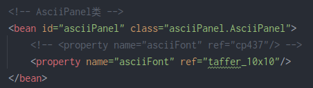

# aw01

## xml-config

### 简介

使用Spring container的xml-config，将[AsciiPanel](https://github.com/trystan/AsciiPanel)改造为一个构件系统，可以创建`AsciiPanel`和不同的`AsciiFont`构件，并将其进行组装并运行。

通过编辑`spring.xml`，可将`cp437`、`cp437_8x8`、`cp437_9x16`、`cp437_10x10`、`cp437_12x12`、`cp437_16x16`、`drake_10x10`、`qbicfeet_10x10`、`taffer_10x10`、`talryth_square_15x15`中的任意一种`AsciiFont`组装进`AsciiPanel`。

在`spring.xml`配置文件中通过构造器注入的方法定义Bean。

### 配置与输出

#### 系统1

#### 系统2

## annotation-config

使用Spring container的annotation-config，将[AsciiPanel](https://github.com/trystan/AsciiPanel)改造为一个构件系统，可以创建`AsciiPanel`和不同的`AsciiFont`构件，并将其进行组装并运行。

通过编辑`value.properties`，可将`cp437`、`cp437_8x8`、`cp437_9x16`、`cp437_10x10`、`cp437_12x12`、`cp437_16x16`、`drake_10x10`、`qbicfeet_10x10`、`taffer_10x10`、`talryth_square_15x15`中的任意一种`AsciiFont`组装进`AsciiPanel`。

使用`@Component`注解声明Bean，使用`@Autowired`注解声明注入方式，使用`@Value`注解将属性值从外部配置文件（如`value.properties`）中注入到Spring Bean中。

### 配置与输出

#### 系统1

#### 系统2

