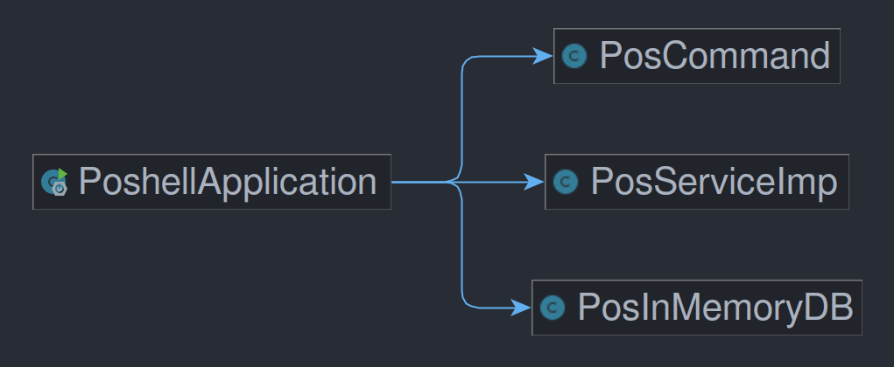

# layered systems
分层是一种分而治之的设计思想，分层架构是一种基于层次的架构范式。通过使用关注分离的方法，系统中的每一层都有其独有的功能，为上层服务，并作为下层客户。

在这次作业中，Pos系统划分为三大层次：用户交互层（`cli`），业务逻辑层（`biz`）和数据层`db`。
- 用户交互层为用户提供了操纵应用的界面，当前使用`ShellComponent`实现其基本功能，完成“人”与“机”的交互工作。
- 业务逻辑层是连接用户交互层和数据层的桥梁，所有“功能”均在业务逻辑层实现，用户交互层只负责调用，数据层只负责把业务逻辑层处理后的数据进行存取。
- 数据层负责数据的IO操作，将上层传来的数据存入数据容器中，受上层调用读取数据并返回。当前使用`List`对数据进行存储，即代码中的`PosInMemory`实现。

通过采取分层架构，可以实现系统的高内聚性和低耦合性。当开发人员想要使用更为优美的前端界面时，只需重写用户交互层的代码，并且调用业务逻辑层提供的`api`即可。同样地，当开发人员想要使用更完善的数据存储系统时（如连接`MySQL`），只需重写`/db/`中对`posDB`接口的实现，向上提供符合约定的`api`即可。

同时，采取分层架构还有利于协作开发，例如`/cli/`可由前端人员开发，`/biz/`和`/db/`由后端人员开发，提高开发效率。