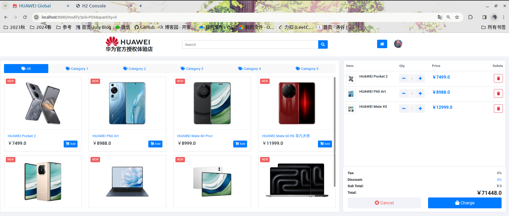
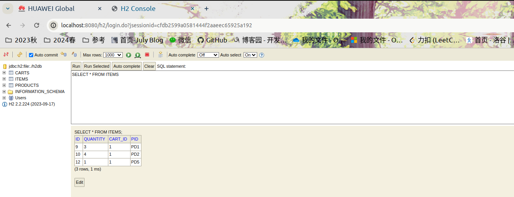
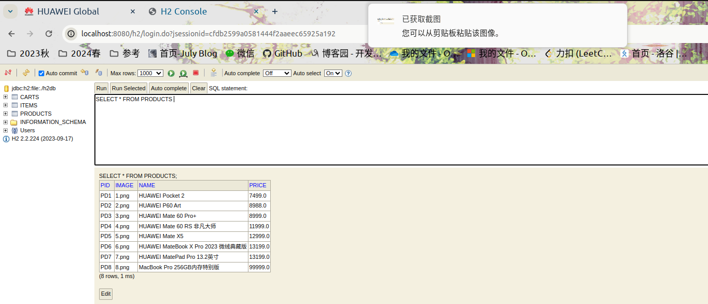
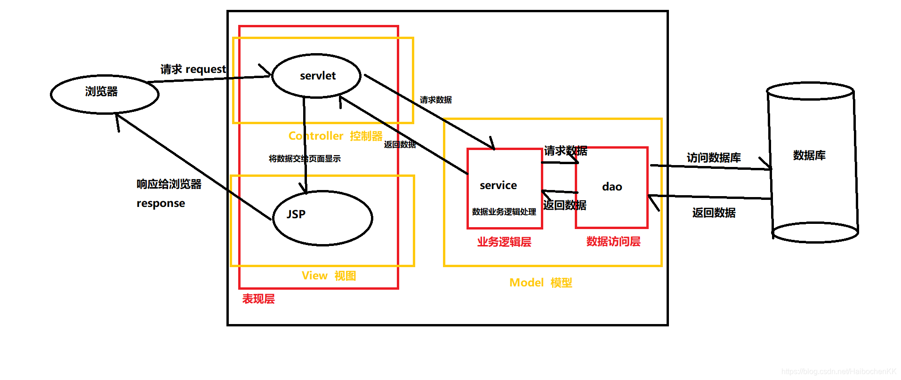

## WebPOS

### 前端页面



### 后端数据库





### To run

```shell
mvn clean spring-boot:run
```

本地运行访问`localhost:8080`

运行时数据库文件见根目录下`h2db.mv.db`

## MVC架构

MVC架构，即模型-视图-控制器架构，是一种广泛应用于软件开发的设计模式。它将应用程序分为三个核心部分：模型（Model）、视图（View）和控制器（Controller）。这三个组成部分各有其特定的职责和功能。

- 模型（Model）：负责数据处理和业务逻辑，包括数据的存储、读取、验证等操作，并且与视图和控制器相互独立，使得模型可以被其他应用程序重复使用。
- 视图（View）：负责显示用户界面，将数据呈现给用户。视图通常是根据模型中的数据生成的，可以根据需要进行定制和修改。
- 控制器（Controller）：负责协调和管理模型和视图之间的交互，并处理用户输入和操作。控制器接收用户的请求，更新模型和视图，将结果返回给用户。



在本次作业的`Spring-MVC`架构中，分为以下几层：

1. View：由`html`结合`thymeleaf`实现界面展示，并且与控制器交互，获取必要的渲染文本信息
2. PosController：返回视图渲染文本`index`，同时与应用逻辑层交互，发送业务要求，包括获得产品列表，购物车内容物变化，计算总和等
3. PosService：向上为PosController提供所需的api，处理控制器发来的逻辑业务，并且与数据层交互，将数据持久化存储
4. PosInH2DB：使用`@Repository`将H2数据库嵌入Spring Boot应用程序，向上为`PosService`提供必要的api用来存取数据

通过应用MVC架构，将视图和模型分离，大大提高了代码的可重用性（多个视图可以共享一个模型）。