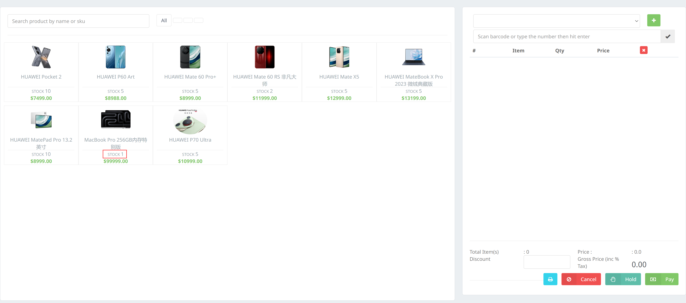
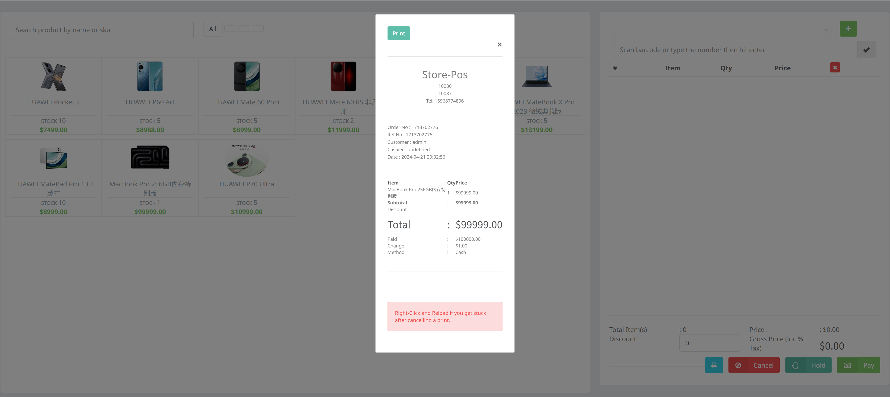
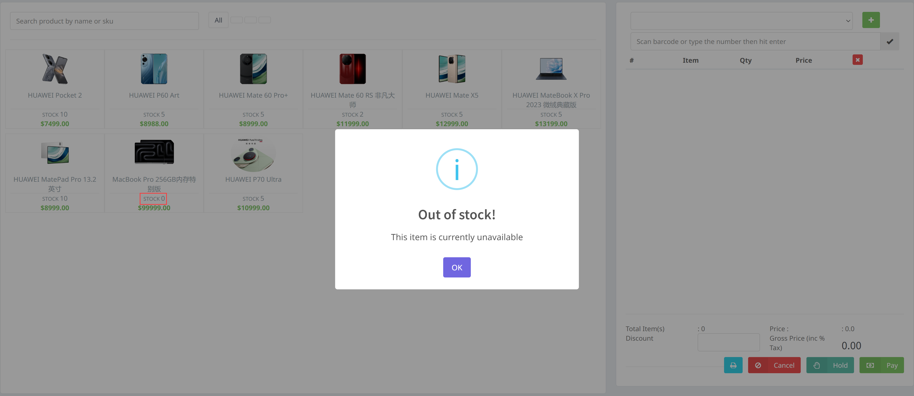

### 项目展示

### RESTfulWebPOS
- 首先定义`api.yml`，设置客户端渲染页面所需的数据结构（资源），这里需要理解客户端的`index.js`代码，并且参考`database/database.json`予以实现
- 然后在`maven`中添加相应的插件以及依赖库，生成接口的标准代码，在`rest`软件包下的`XXXController`类中实现相应api接口，在`mapper`软件包下实现对应的`MapConstruct`，响应服务器请求，包括：
  - GET
  - POST（或者PATCH)
  - PUT
  - DELETE
  
  在此次实验中，仅需要实现GET和PATCH即可实现所有目标功能
- 客户端获得服务器提供的响应（返回状态代码与json文本）后，即可在浏览器中渲染更新页面

### 应用状态，资源状态，无状态交互
- 在本次实验中，应用状态指的是购物车的状态，由客户端进行维护；资源状态指的是“库存”，由服务端进行维护
- 同时在RESTful架构下，服务端不应该记录客户端所拥有的状态信息，来自客户端的每个请求都应该包含处理该请求所需的一切信息，这种交互是无状态的（幂等）
- 这种无状态通信原则，使得服务端和中介能够理解独立的请求和响应。在多次请求中，同一客户端也不再需要依赖同一服务器，方便实现高可扩展和高可用性的服务端
- 而对于客户端来说，“会话”状态是被客户端作为应用状态进行跟踪的。客户端应用状态在服务端提供的超媒体的指引下发生变迁。服务端通过超媒体告诉客户端当前状态有哪些后续状态可以进入

### 一些其他的记录

跨域访问

### 一些建议
这次作业，从我做的观感上，开始到完成花费的时间过长，大约25h。首要原因当然是我经验不足，对前端js代码比较陌生，以及当时未能熟练掌握网络通信的基本的调试方式（抓包）

但是除此之外，我仍想为此次作业设计提出一些建议：
- 非常感谢老师给出前端框架代码，但是在将前端代码“写死”的情况下，可以为冗杂的前端代码提供简洁的、指导性的手册
- 另外前端代码在Linux系统的兼容性上可能存在问题，在我的测试中无法在Linux系统（我有两台Linux设备）下成功运行`npm run build`命令
- 前后端的兼容性有待加强，比如：
  - 前端用的拉取命令是`/product/`，后端api.yml中定义的却是`/products/`
  - 前端使用的`ProductId`是Integer类型的id，后端实现却是String类型的pid
- `client`中从假后端服务到真服务器的可移植性表现不佳，前端代码需要在某些细节处加“引号”
- 以及前端代码数据类型中奇怪的`stock`,`quantity`字段并不优美

最后感谢老师这次作业带给我的思考与锻炼，作业设计很有创意，也很有可玩性，做完的时候收获到了成就感，同时加深了我对Restful架构的理解

希望它以后变得更好！