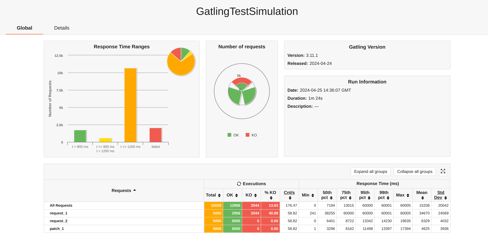
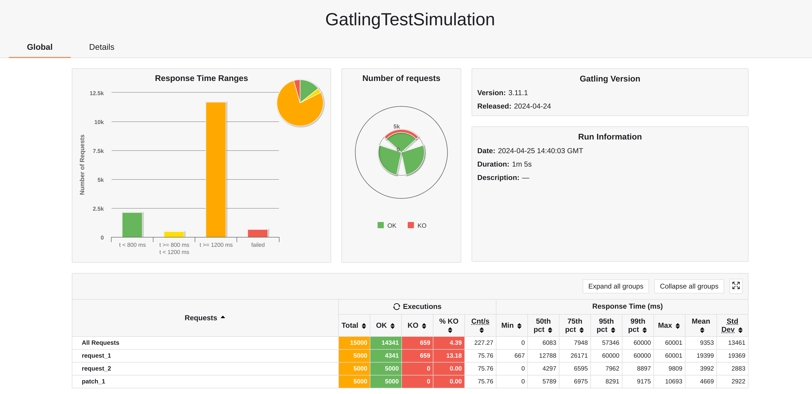
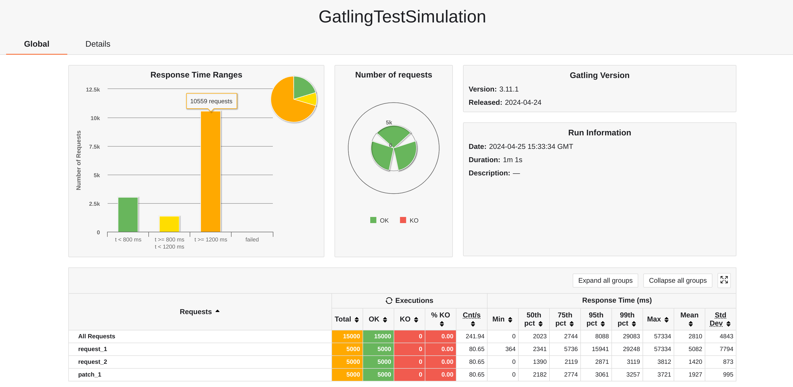
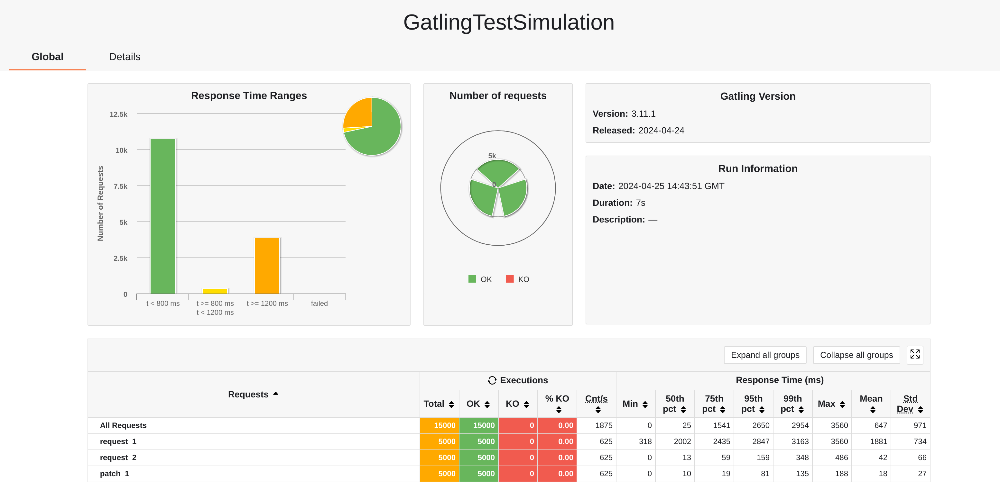
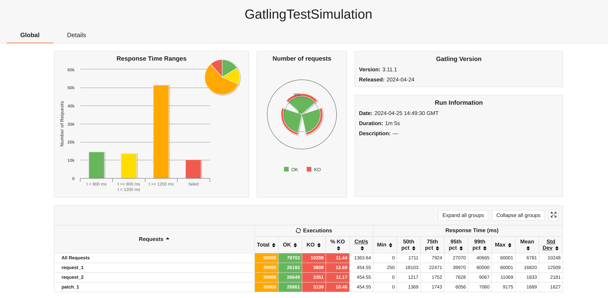
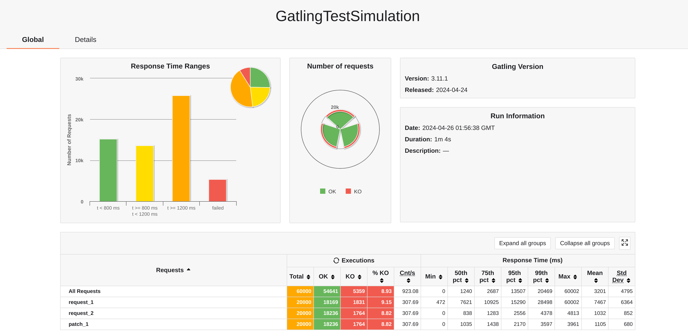
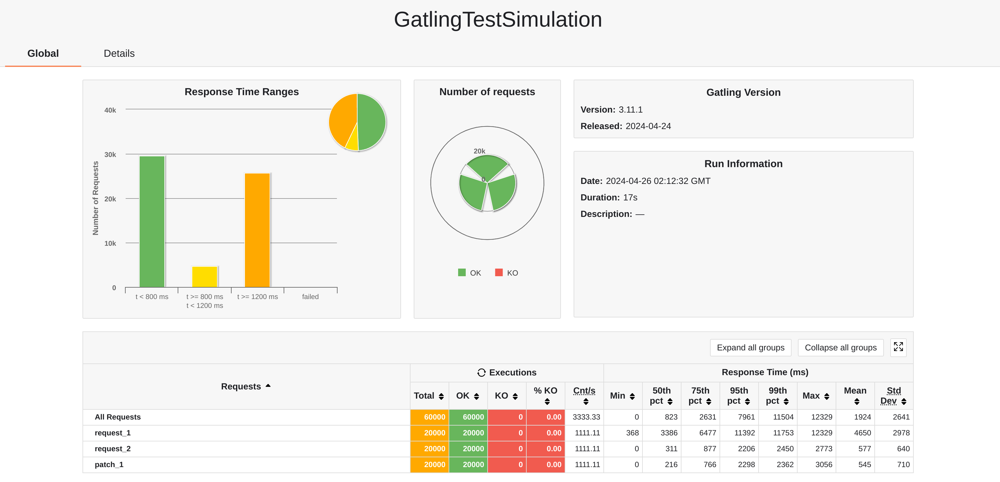
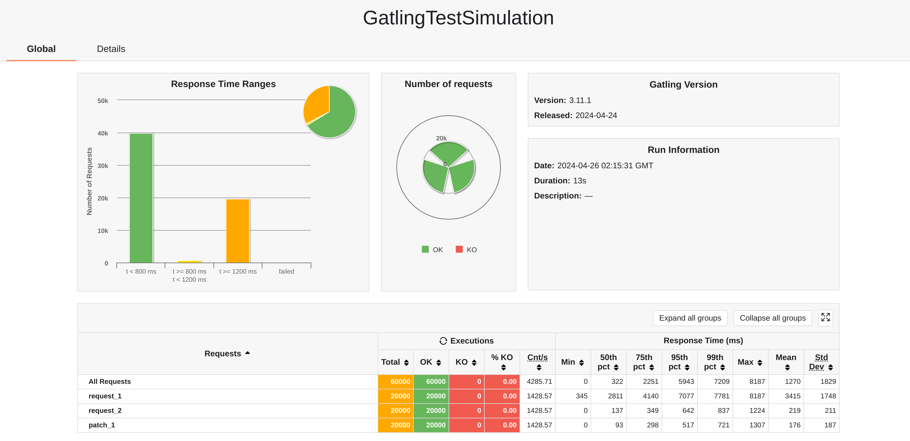
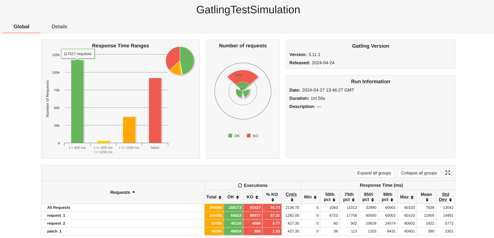
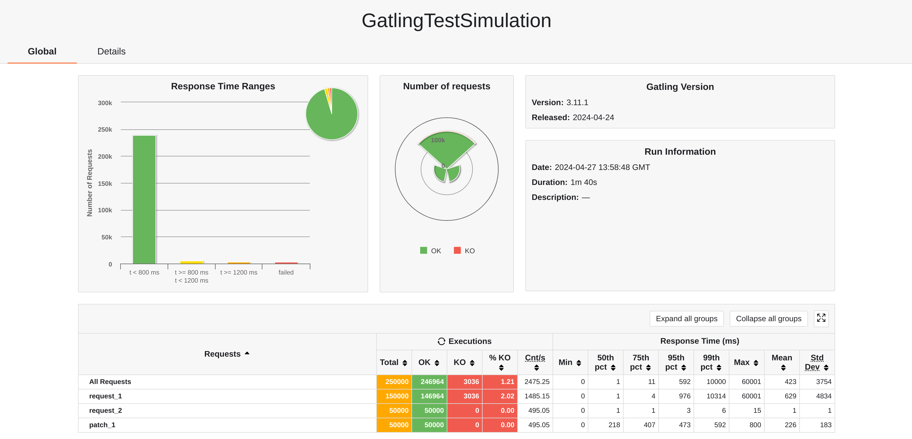

# Scalable WebPOS

## 一、垂直可扩展的WebPOS

### 1.1 Docker镜像创建
```xml
            <plugin>
                <groupId>com.google.cloud.tools</groupId>
                <artifactId>jib-maven-plugin</artifactId>
                <version>3.4.2</version>
                <configuration>
                    <to>
                        <image>app-webpos-cached</image>
                    </to>
                </configuration>
            </plugin>
```
首先添加构建Docker镜像所需的插件依赖，然后使用`mvn clean compile jib:dockerBuild`构建Docker镜像。

### 1.2 配置gatling测试环境

参考 https://github.com/gatling/gatling-maven-plugin-demo-java ，见`gatling`项目下

其中测试部分使用如下模拟，表示从打开网页到付款结束一次购物过程。

```java
    ScenarioBuilder scn = scenario("getProducts")
            .exec(http("request_1").get("/product"))
            .pause(2)
            .exec(http("request_2").get("/product/10025150989594"))
            .pause(2)
            .exec(http("patch_1").patch("/product/10025150989594").body(StringBody("{\"quantity\":\"5\"}")).asJson());
```

### 1.3 利用Docker镜像构建容器实例并运行

运行命令`docker run -d -p 8080:8080 --cpus $可使用cpu核心数 app-webpos-cached`，将容器中的8080端口映射到主机上的8080端口，并运行容器实例。

### 1.4 测试结果

#### cpus=0.5，5000名虚拟用户同时使用


#### cpus=1，5000名虚拟用户同时使用


#### cpus=2，5000名虚拟用户同时使用


#### cpus=6，5000名虚拟用户同时使用


#### cpus=6，30000名虚拟用户同时使用


根据上述压测结果表明：
- 若测试压力相同，可使用cpu核心数越多，测试结果表现越好（延迟越低）
- 若cpu核心数相同，测试压力越大，测试结果表现越差（延迟越高）
- 当测试压力达到一定程度（虚拟用户数目较多），垂直扩展容易达到它的上限，难以满足实际生产需要

## 二、水平可扩展的WebPOS

### 2.1 配置HA-Proxy并运行

编写`haproxy.cfg`（在`config/`目录下）并使用如下命令运行

```shell
haproxy -f config/haproxy.cfg
```

在三次实验中，采用4层负载均衡（tcp），使用轮询策略，分别对后端有一台服务器，两台服务器和四台服务器的情况进行测试。

### 2.2 利用Docker镜像构建容器实例并运行

使用前述命令，构建四个容器实例，每个容器可使用cpu核心数为1,将容器的8080端口分别映射到宿主机的8081,8082,8083,8084号端口（与`haproxy.cfg`对应）。

### 2.3 测试结果

#### 后端服务器数目为1，20000名虚拟用户同时使用



#### 后端服务器数目为2，20000名虚拟用户同时使用



#### 后端服务器数目为4，20000名虚拟用户同时使用



测试结果显示随着横向扩展，性能表现逐渐提升，平均延迟大幅降低。说明横向扩展，添加更多的服务器，可以将负载分散到多个节点或实例上，可以减轻单个节点的压力，使得系统更加稳定可靠。

同时我认为横向扩展依旧不是万能的，若在系统中像之前一样使用h2数据库，这依然可能存在瓶颈。当系统中存在单点数据库时，横向扩展可能无法有效提高性能，数据库的读写压力、连接数限制等问题可能导致横向扩展受限，同时存在单点失效问题。

## 三、构建Redis集群缓存商品

### 3.1 开启Redis服务

使用命令`service redis-server start`开启Redis服务

### 3.2 添加Redis有关依赖，并进行相应配置

``` xml
        <dependency>
            <groupId>org.springframework.boot</groupId>
            <artifactId>spring-boot-starter-cache</artifactId>
        </dependency>
        <dependency>
            <groupId>org.springframework.boot</groupId>
            <artifactId>spring-boot-starter-data-redis</artifactId>
        </dependency>
```
然后在`resource`文件夹下的`application.properties`文件中配置Redis集群相关属性

`Product`类中需要实现`Serializable`接口完成序列化，Spring启动类需要加上`@EnableCaching`注解，`PosServiceImp`类中的相应方法上需要使用`@Cacheable`注解

### 3.3 测试结果

利用前述gatling测试模块在本机上对服务器进行压力测试，增大压力至50000名用户同时使用，同时为体现缓存行为的优势，重写了测试模拟的行为，让一个用户多次执行`.exec(http("request_1").get("/product"))`过程。

这其实也挺常见的，比如说用户卡点抢折扣购买商品会出现多次刷新商品页面的行为。

#### 未使用Redis集群作为缓存机制



#### 使用Redis集群作为缓存机制



以上测试说明访问延迟大大降低，服务器性能在使用Redis集群后得到极大提升，这验证了缓存的重要作用。

通过使用Redis集群构建服务器缓存，保证了应用后端的高可用性，不会出现前面提到的单点失效问题。另外Redis集群也可以通过分布数据到不同的节点上，实现负载均衡，避免单个节点成为瓶颈。总的来说，Redis集群的使用提高了系统的可靠性、性能和扩展性，是构建高效缓存系统的有效方式。

