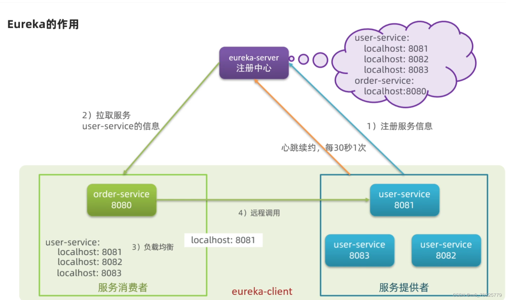
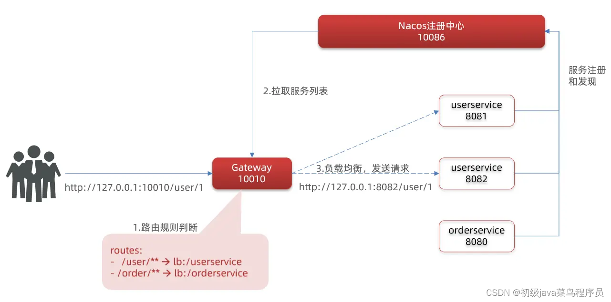
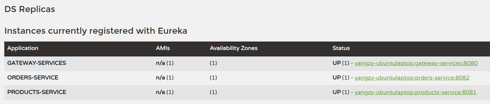
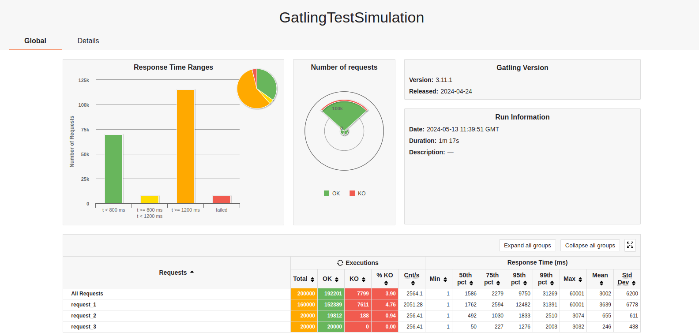
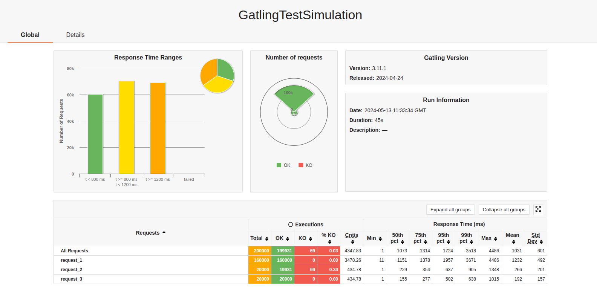
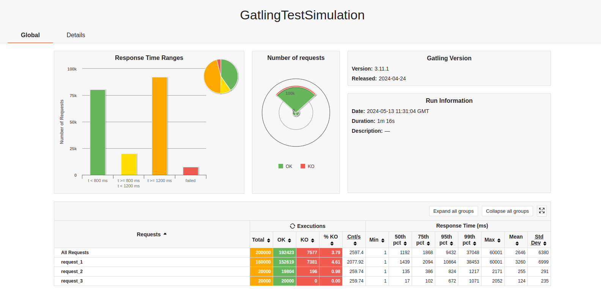
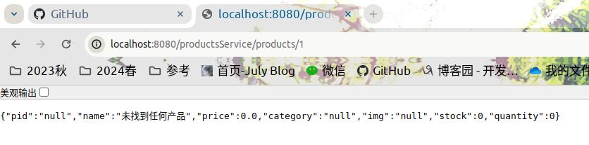

# Micro WebPoS

## 一、系统实现

用户在使用购物平台时，对产品管理和订单管理这两项服务有不同的需求，具体表现为：一名用户可能频繁地浏览商品页面获取商品信息（产品管理的内容），却很少将商品加入购物车并完成支付行为（订单管理内容）。因此可以使用微服务架构对当前系统进行优化，把产品管理和订单管理这两项服务拆分开来，并在需要的时候对它们的服务能力分别进行扩展。在本次实验中，利用Spring Cloud + Eureka组件进行工程实现，具体实现细节为：



### 1.1 搭建Eureka注册中心，pos-discovery

在第一个微服务组件中，需要配置`EurekaServer`服务端：
- 引入`EurekaServer`依赖：
    ```xml
        <!--eureka服务端-->
        <dependency>
            <groupId>org.springframework.cloud</groupId>
            <artifactId>spring-cloud-starter-netflix-eureka-server</artifactId>
        </dependency>
    ```
- 在启动类上添加`@EnableEurekaServer`注解，开启`Eureka`注册中心功能
- 在`application.yml`中对`Eureka`的服务端进行相应配置，包括服务端口号，微服务名称等

### 1.2 Gateway动态路由负载均衡，pos-gateway

`gateway`是微服务的API网关，能够实现服务的路由，过滤，断言，流量控制，日志监控等操作。`gateway`相当于所有服务的门户，将客户端请求与服务端应用相分离，客户端请求通过gateway后由定义的路由和断言进行转发，路由代表需要转发请求的地址，断言相当于请求这些地址时所满足的条件，只有同时符合路由和断言才给予转发。

同时`gateway`也是一个微服务客户端，需要使用注解`@EnableEurekaClient`在`Eureka`上进行注册，并编写相应配置文件`application.yml`配置路由，隐藏注册进服务的生产端端口号。

在我的实现中，通过路径匹配的方式实现进行路由，将“产品管理”和“订单管理”请求分别发送至不同的业务服务端。



引入依赖：
```xml
    <!--eureka服务端-->
    <dependency>
        <groupId>org.springframework.cloud</groupId>
        <artifactId>spring-cloud-starter-netflix-eureka-client</artifactId>
    </dependency>
```

配置路由：
```yml
spring:
  application:
    name: gateway-services
  cloud:
    gateway:
      routes:
        - id: products-service
          # 负载均衡到名为`products-service`的服务实例
          uri: lb://products-service
          # 定义路由规则的条件
          predicates:
            - Path=/productsService/**
        - id: orders-service
          # 负载均衡到名为`orders-service`的服务实例
          uri: lb://orders-service
          # 定义路由规则的条件
          predicates:
            - Path=/ordersService/**
```

### 1.3 业务处理，pos-products、pos-orders

同样使用`@EnableEurekaClient`向`Eureka`注册服务，在`web`软件包写编写相应代码进行业务处理，与之前`RESTful架构`的服务端工作逻辑类似。最终运行结果如下图所示，表示上述三个实例（gateway、products和orders）已经注册到了`Eureka`上。



## 二、实验验证

### 2.1 压力测试实验

由于在一般的购物场景中，一名用户可能频繁地浏览商品页面获取商品信息（产品管理的内容），却很少将商品加入购物车并完成支付行为（订单管理内容）。因此在设计压力测试内容时，模拟了用户多次请求`productsService`服务，偶尔请求`ordersService`的场景。

本次压力测试中模拟20000名虚拟用户同时使用购物平台，利用`HA-proxy`对“产品管理微服务”进行水平扩展（详见aw05）比较系统性能，测试结果如下：

#### 水平扩展前，“产品管理”微服务和“订单管理”微服务数为1



#### 水平扩展后，“产品管理”微服务数为2，“订单管理”微服务数为1



#### 水平扩展前，“产品管理”微服务数为1，“订单管理”微服务数为2



可见水平扩展“订单管理”微服务对系统性能提升不大（1m17s -> 1m16s），水平扩展“产品管理”微服务较好地提升了系统性能（1m17s -> 45s），通过对高压力微服务组件（性能瓶颈）进行适当水平扩展，能增加计算资源利用率，实现“手术刀式”的系统优化。

同时这也验证了`Client-side LB`的可行性。

### 2.2 断路器

在产品管理中尝试使用断路器机制，增强微服务的鲁棒性。在查找产品的过程中，我们可能尝试查找一个不存在的商品（`productId`不存在）。此时在传统方法中我们会返回一个`404 NOT FOUND`，这并不优雅，也反映了网站的鲁棒性并不好。利用断路器机制后，可以做到更为优雅的实现：

- 首先在`posServiceImp`类中，若查找服务得到一个空结果，将throw一个`HttpClientErrorException`
- 在`ProductController`类中，若断路器若catch到一个Exception，将激活断路器，返回一个预设的结果：
  ```
        circuitBreaker.run(
            () -> ResponseEntity.ok(productMapper.toProductDto(posService.getProduct(productId))),
            throwable -> ResponseEntity.ok(productMapper.toProductDto(new Product("null", "未找到任何产品", 0, "null", "null")))
        );
  ```
- 最终结果如下所示：
  
