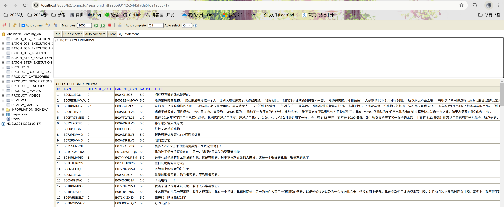

# aw07 - Big data for MicroPos

## 一、数据处理流程

### 1.1 建立数据模型

下载了`Gift_Cards`和`Magazine_Subscriptions`两大类数据。根据原始的`.jsonl`文本创建数据模型，其中`Product`类有main_category、title、images等字段，`Review`有rating、title、text等字段。

### 1.2 建表

使用注解快速建表
1. @Entity: JPA（Java Persistence API）注解，表明这是一个 JPA 实体类，将映射到数据库表 
2. @Table(name = "table_name"): 指定该实体映射到数据库中名为"table_name"的表 
3. @JsonIgnoreProperties(ignoreUnknown = true): Jackson库的注解，用于在反序列化JSON时忽略未知的属性 
4. @JsonProperty("XXX"): Jackson库的注解，用于指定JSON字段名与Java类属性名的映射关系 
5. 使用@ElementCollection、@CollectionTable、@Embeddable建立子表，用于存储images等集合元素，具体见`batch.model.Product`

### 1.3 Spring Batch作业

创建一个Spring Batch作业来处理`resources/`目录下的原始`.jsonl`文本，并通过相应步骤转为对应类，再写入数据库中。

具体来讲，将整个Job分为两个Flow，每个Flow包含两个Step，分别用来读取产品的meta信息以及评论信息。

每一Step下，
- 在reader阶段，将使用`objectMapper`将文本信息转变为对应对象信息；
- 在processor阶段，可以对流经的数据进行一些复杂的处理，我在这里做的工作是将评论从英文翻译为中文；
- 在writer阶段，将数据对象写入数据库中的对应表中。

### 1.4 优化工作

1. 批处理

    若每处理完一条数据，便将其插入数据库，将导致系统的IO开销巨大；而若一次性插入数据条数过多，将增大内存开销，降低事务处理性能。因此需要使用批处理技术，通过合理设置批处理大小（chunksize），将数据批量插入数据库。
    ```
        <Class, Class>chunk(10, transactionManager);
    ```
2. 并行处理
    
   在我的实现中读取产品的meta信息以及评论信息是分开进行的，它们事实上也会被存在两张不同的表中，适合并行操作。
   
   利用流构建器`FlowBuilder`中的`split`方法调用`taskExecutor()`设置流的分裂操作。我令`taskExecutor()`返回一个容量为2的线程池，在流程中并行执行任务。这种情况下，这个线程池将被用于流的分支操作，允许flow1和flow2在并行线程中执行。

    ```java
       @Bean
        public TaskExecutor taskExecutor() {
            ThreadPoolTaskExecutor executor = new ThreadPoolTaskExecutor();
            executor.setCorePoolSize(2);
            executor.setMaxPoolSize(2);
            executor.setThreadNamePrefix("batch_step_thread");
            executor.initialize();
            return executor;
        }
   ```

## 二、效果

`REVIEWS`表如下图所示，可以看出其中评论文本栏`TEXT`已被翻译为中文。




## 三、数据源

[Amazon Review Data (2023)](https://amazon-reviews-2023.github.io/) 是一个包含从1996年到2023年间Amazon商品、用户和评价数据的海量数据集，概况如下：

|评论| 用户 | 商品 |
|--| -- | -- |
|571.54M|54.51M|48.19M|
