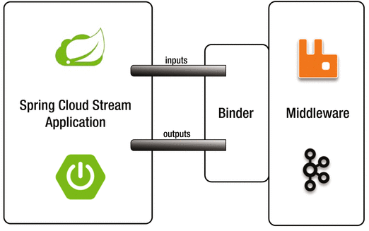
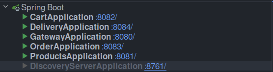
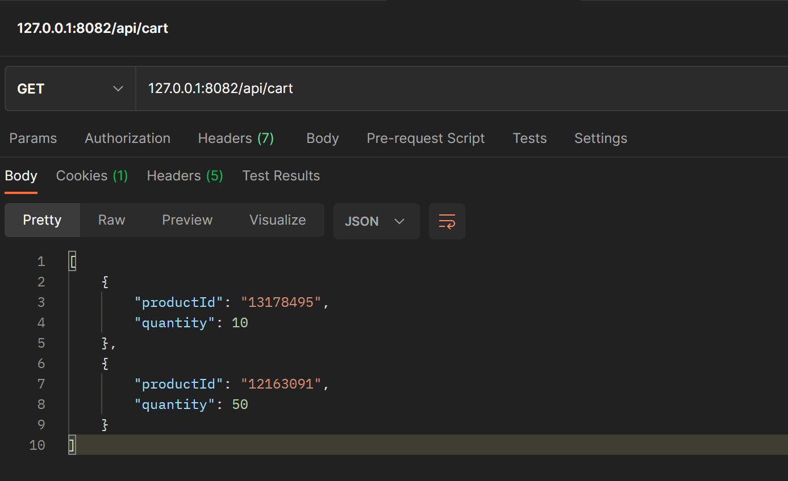
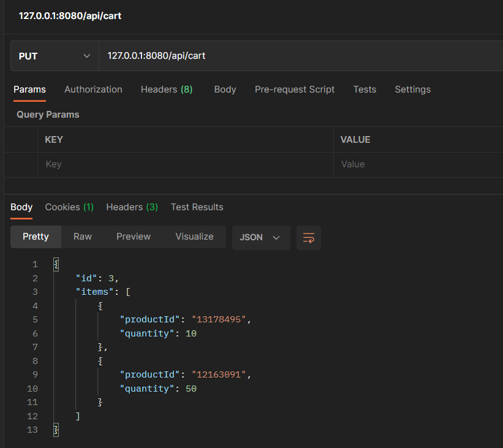
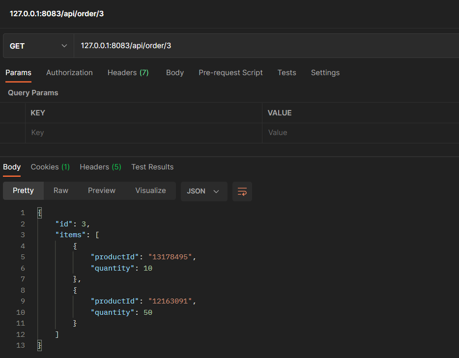
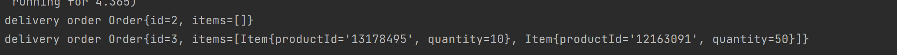

# aw08-事件驱动架构

## 一、安装并配置AMQP消息中间件

- RabbitMQ是实现了高级消息队列协议（AMQP）的开源消息代理软件（亦称面向消息的中间件）。在本次实验中，我选择使用RabbitMQ中间件。
- 在Spring中进行相应配置，以集成RabbitMQ：
   ```yml
    spring:
      application:
        name: order-service
      rabbitmq:
        port: 5672
        host: localhost
        username: your_username
        password: your_passwd
  ```

## 二、Spring Cloud Stream
Spring Cloud Stream 是一个用于构建消息驱动型微服务的框架。它是 Spring Cloud 生态系统中的一个组件，建立在 Spring Boot 之上，旨在简化和统一消息中间件的集成和使用。
通过设置`Binder`可以很方便的与中间件进行连接。



- 引入有关依赖：
   ```xml
   <dependency>
      <groupId>org.springframework.cloud</groupId>
      <artifactId>spring-cloud-starter-stream-rabbit</artifactId>
   </dependency>
  
    <dependency>
        <groupId>org.springframework.boot</groupId>
        <artifactId>spring-boot-starter-amqp</artifactId>
    </dependency>
  ```

- 进行相应配置：该配置将一个名为`orderDelivery`的函数与名为`delivery`的流进行绑定，以处理传入的订单数据，用于展示订单交付情况。在`orderDelivery`只进行了简单的实现，将订单信息在命令行中打印。在`pos-order`包内，一条订单信息被deliver后，将向`delivery`流发送消息。
   ```yml
  spring:
    application:
      name: delivery-service
    cloud:
      function:
        definition: orderDelivery
      stream:
        function:
          bindings:
            orderDelivery-in-0: delivery
  ```

## 三、运行效果

1. 启动的微服务, (同时还有RabbitMQ服务)：
   
2. 添加商品至购物车，图为当前购物车状态：
   
3. checkout生成订单, 可以看到获取的订单编号为3：
   
4. 向订单服务查询, 可以看到还未分发的订单3：
   
5. 发送交付订单请求, `pos-order`包内相应方法将生产订单交付的消息至`delivery`流, 然后在`delivery-service`服务的终端下可以看到交付订单的信息：
   ```java
    @Bean
    public Consumer<Order> orderDelivery() {
        return new OrderDelivery();
    }
   ```
   ```java
    public class OrderDelivery implements Consumer<Order> {
        @Override
        public void accept(Order order) {
            System.out.println("delivery order " + order);
        }
    }
   ```
    
