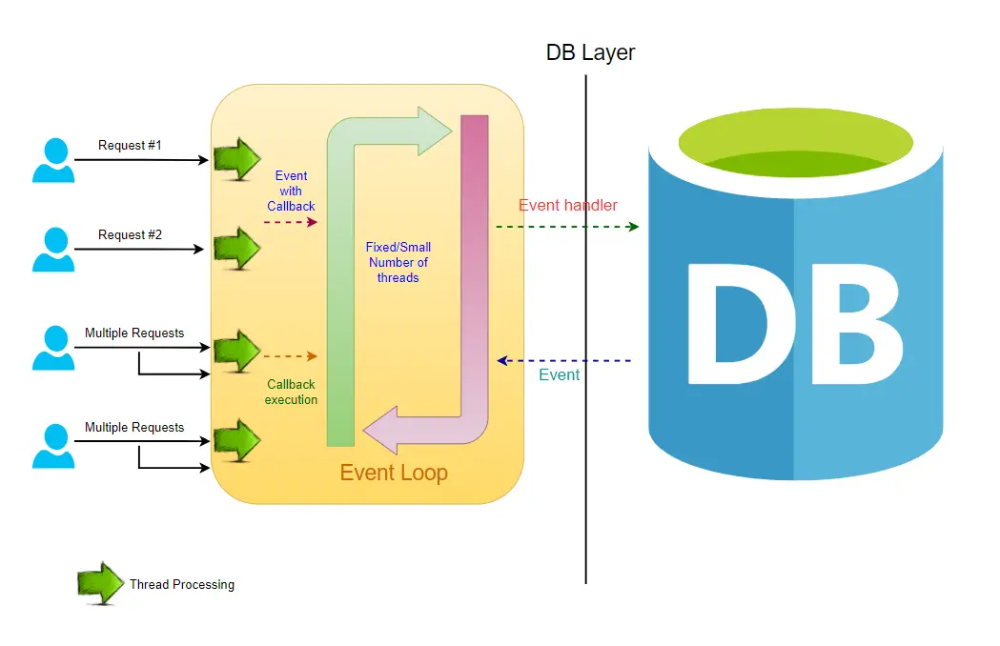
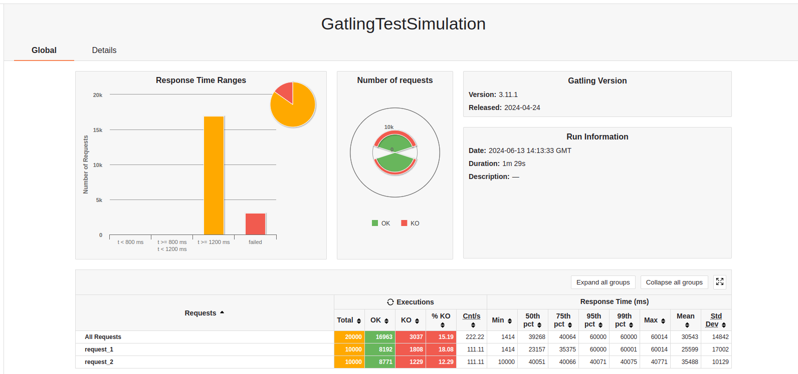
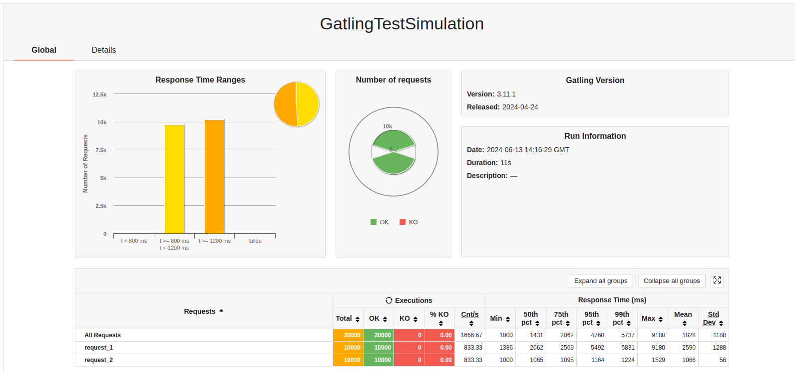

# aw09-final

## 一、基于Spring Webflux的响应式架构设计

### 1.1 Spring Webflux

`Spring WebFlux`是Spring Framework 5.0中引入的新的响应式web框架，用于构建异步、非阻塞的响应式应用程序。与`Spring MVC`不同，它默认使用`Reactor-Netty`底层库，基于Reactive Streams标准，支持响应式编程模型。

`Spring Webflux`提供了基于函数式编程风格的API，也支持基于注解的编程模型。它可以与不同的反应式流库（如Project Reactor）结合使用，实现异步处理和流式数据处理。`Spring Webflux`适用于构建高性能、高吞吐量的应用程序，特别是在需要处理大量并发请求的场景下表现出色。通过使用`Spring Webflux`，我们可以构建具有弹性、可伸缩性和高性能的应用程序（POS机），同时能够更好地处理I/O密集型操作、大规模并发和流式数据处理。这使得`Spring Webflux`成为一种现代化、灵活且强大的框架，适用于构建现代的互联网应用程序。



### 1.2 实验过程

在本次实验中，我使用了`Spring WebFlux`框架优化了POS机的性能。

- 引入Spring WebFlux依赖：
    ```xml
        <dependency>
            <groupId>org.springframework.boot</groupId>
            <artifactId>spring-boot-starter-webflux</artifactId>
        </dependency>
    ```
- 在Web Layer我们使用基于基于注释的响应式组件（*Annotation-based Reactive Components*）。与`Spring MVC`不同的是类型（响应式数据流）`Mono`和`Flux`的使用：在响应式编程中，`Mono`和`Flux`是Project Reactor库中的两个主要类型，用于处理异步数据流。它们是Reactive Streams规范的实现，可以让你编写响应式和非阻塞的代码。
    ```java
    @GetMapping("/products")
    public Flux<ProductDto> listProducts() {
        return productService.products().map(productMapper::toProductDto);
    }

    @GetMapping("/products/{productId}")
    public Mono<ProductDto> showProductById(@PathVariable String productId) {
        return productService.getProduct(productId).map(productMapper::toProductDto).delayElement(Duration.ofMillis(latency));
    }
    ```
- 详情见`webflux-pos/`文件夹下的`pos-webflux-products`模块。

### 1.3 实验结果

在本次实验中，我们使用`gatling`压力测试工具，模拟10000名虚拟用户同时使用购物平台，每位用户将间隔1s访问两次商品页。

#### 传统的Spring MVC架构



#### Spring WebFlux架构



显然在Spring WebFlux架构下购物平台展现了更优的性能。这是因为传统的`Servlet`会造成资源浪费，当服务与外部交互时（比如`Http`请求，数据库查询），线程是处于阻塞状态的。这也就是说，如果某接口的请求含有大量这种外部交互，比如有$\frac{1}{3}$的时间用于Http请求，$\frac{1}{3}$用于数据库查询/入库，那么理论上接口请求容纳量是可以提升接近3倍的。

通过异步执行的方式，“请求过程”在进行外部交互时使用**发布-订阅设计模式**释放线程资源，等待外部交互执行完成后，可以重新获取资源继续执行，在此之前CPU可以服务其他请求，从而增强处理大批量的请求的能力。

## 二、The Reactive Manifesto

[The Reactive Manifesto](https://www.reactivemanifesto.org)

### 2.1 Responsive

这个POS机系统是**Responsive**的。

首先我们都了解，一台计算器，它的CPU的频率是一定的，就算是超频也是有极限的，内存也是一样（能做的只有虚拟内存这种利用空间/时间局部性原理的策略，但是这个效率提升依然是有物理极限的）。

通过使用`Spring WebFlux`框架([aw09](https://github.com/sawork-2024/aw09-yangzy0723))，使得整个系统是高响应性的。原有的MVC框架，使用传统的`Servlet`将造成资源的浪费，当服务与外部交互时（比如`Http`请求，数据库查询），线程是处于阻塞状态的。这使得服务器无法快速响应客户端的请求。通过使用`Spring WebFlux`框架实现异步处理和流式数据处理，极大地增强了处理大批量的请求的能力，保证POS机系统的Responsive。

通过使用`Redis集群`缓存商品信息([aw05](https://github.com/sawork-2024/aw05-yangzy0723))，降低访问延迟，同样有助于保证系统的Responsive。使用Redis集群构建服务器缓存，保证了应用后端的高可用性，当请求量增加时，Redis集群可以水平扩展，增加节点数量以应对更高的负载，从而保持系统的响应速度。

### 2.2 Resilient

这个POS机系统是**Resilient**的。

"Resilient"意味着具有弹性和适应性，指的是系统或个体面对压力、挑战或变化时能够保持稳定并迅速恢复正常状态的能力。一个弹性强的系统能够有效地应对各种不可预测的情况，如故障、攻击、自然灾害等，并在面临挑战时迅速适应、恢复和重新建立稳定状态。

通过使用断路器机制([aw06](https://github.com/sawork-2024/aw06-yangzy0723))，增强系统对服务间通信的鲁棒性。它可以防止故障的服务请求不断地影响整个系统，类似于电路中的断路器保护电路。断路器通过监控对特定服务的请求情况，并在出现故障时暂时切断对该服务的请求，避免系统雪崩效应。

通过使用`HA-Proxy`([aw05](https://github.com/sawork-2024/aw05-yangzy0723))，构建水平扩展的POS机，在一定程度上也减少了单点失效问题的发生，增强了系统的鲁棒性。

### 2.3 Elastic

这个POS机系统是**Elastic**的。

基于Java跨平台的特性，对这个POS机系统进行垂直扩展是很轻松的。只要获得更好的硬件，便可以对这个系统进行垂直扩展，它可以轻松地运行在ARM、X86等流行的处理器架构上。

同时这个POS系统也是水平可扩展的，利用`Spring Cloud + Eureka`组件实现微服务架构([aw06](https://github.com/sawork-2024/aw06-yangzy0723))，可以对高压力微服务组件（性能瓶颈）进行适当水平扩展，能增加计算资源利用率，实现“手术刀式”的系统优化。

### 2.4 Message Driven

这个POS机系统是**Message Driven**的。

该POS机系统中微服务组建的耦合主要是以下情况：
- `carts-service`微服务组件需要从`products-service`微服务组件得到商品的信息
- `order-service`微服务组件向`delivery-service`微服务组件发送订单交付请求

考虑到前者的需求，前者并不能处理成异步，因为后续服务需要这个信息，所以这里必须是阻塞的。而后者基于`Spring Cloud Stream`，使用消息队列`RabbitMQ`实现异步处理([aw08](https://github.com/sawork-2024/aw08-yangzy0723))，是消息驱动的。